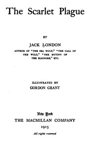

# The Scarlet Plague <kbd>21970</kbd>

## Authors

 - London, Jack <small>(1876 - 1916)</small>

## Subjects

 - End of the world -- Fiction
 - Epidemics -- Fiction
 - Regression (Civilization) -- Fiction
 - Science fiction

## Download

 - https://www.gutenberg.org/files/21970/21970-0.zip
 - https://www.gutenberg.org/cache/epub/21970/pg21970.cover.medium.jpg
 - https://www.gutenberg.org/files/21970/21970-h.zip
 - https://www.gutenberg.org/files/21970/21970.zip
 - https://www.gutenberg.org/files/21970/21970-8.txt
 - https://www.gutenberg.org/ebooks/21970.html.images
 - https://www.gutenberg.org/files/21970/21970-h/21970-h.htm
 - https://www.gutenberg.org/ebooks/21970.epub.images
 - https://www.gutenberg.org/ebooks/21970.rdf
 - https://www.gutenberg.org/ebooks/21970.kindle.images

## Book Shelves

