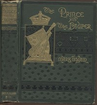

# The Prince and the Pauper <kbd>1837</kbd>

## Authors

 - Twain, Mark <small>(1835 - 1910)</small>

## Subjects

 - Boys -- Fiction
 - Edward VI, King of England, 1537-1553 -- Fiction
 - Historical fiction
 - Impostors and imposture -- Fiction
 - London (England) -- Fiction
 - Lookalikes -- Fiction
 - Poor children -- Fiction
 - Princes -- Fiction
 - Social classes -- Fiction

## Download

 - https://www.gutenberg.org/files/1837/1837-0.zip
 - https://www.gutenberg.org/cache/epub/1837/pg1837.cover.medium.jpg
 - https://www.gutenberg.org/files/1837/1837-0.txt
 - https://www.gutenberg.org/ebooks/1837.html.images
 - https://www.gutenberg.org/files/1837/1837-h/1837-h.htm
 - https://www.gutenberg.org/ebooks/1837.kindle.images
 - https://www.gutenberg.org/ebooks/1837.rdf
 - https://www.gutenberg.org/ebooks/1837.epub.images

## Book Shelves

 - Historical Fiction
