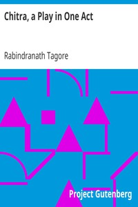

# Chitra, a Play in One Act <kbd>2502</kbd>

## Authors

 - Tagore, Rabindranath <small>(1861 - 1941)</small>

## Subjects

 - Indic drama

## Download

 - https://www.gutenberg.org/files/2502/2502-h/2502-h.htm
 - https://www.gutenberg.org/cache/epub/2502/pg2502.cover.small.jpg
 - https://www.gutenberg.org/files/2502/2502.zip
 - https://www.gutenberg.org/files/2502/2502.txt
 - https://www.gutenberg.org/ebooks/2502.html.images
 - https://www.gutenberg.org/ebooks/2502.rdf
 - https://www.gutenberg.org/ebooks/2502.epub.images
 - https://www.gutenberg.org/ebooks/2502.kindle.images
 - https://www.gutenberg.org/ebooks/2502.txt.utf-8

## Book Shelves

 - One Act Plays
