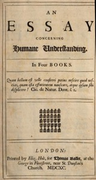

# An Essay Concerning Humane Understanding, Volume 1: MDCXC, Based on the 2nd Edition, Books 1 and 2 <kbd>10615</kbd>

## Authors

 - Locke, John <small>(1632 - 1704)</small>

## Subjects

 - Knowledge, Theory of -- Early works to 1800

## Download

 - https://www.gutenberg.org/files/10615/10615-h.zip
 - https://www.gutenberg.org/ebooks/10615.html.images
 - https://www.gutenberg.org/cache/epub/10615/pg10615.cover.medium.jpg
 - https://www.gutenberg.org/files/10615/10615-0.txt
 - https://www.gutenberg.org/ebooks/10615.txt.utf-8
 - https://www.gutenberg.org/ebooks/10615.epub.images
 - https://www.gutenberg.org/ebooks/10615.rdf
 - https://www.gutenberg.org/ebooks/10615.kindle.images

## Book Shelves

 - Banned Books from Anne Haight's list
