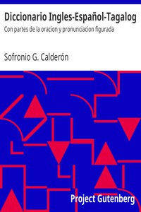

# Diccionario Ingles-Español-Tagalog: Con partes de la oracion y pronunciacion figurada <kbd>20738</kbd>

## Authors

 - Calderón, Sofronio G. <small>(1878 - 1953)</small>

## Subjects

 - English language -- Dictionaries -- Polyglot
 - English language -- Dictionaries -- Spanish
 - English language -- Dictionaries -- Tagalog

## Download

 - https://www.gutenberg.org/files/20738/20738-8.txt
 - https://www.gutenberg.org/files/20738/20738-h/20738-h.htm
 - https://www.gutenberg.org/files/20738/20738-h.zip
 - https://www.gutenberg.org/cache/epub/20738/pg20738.cover.small.jpg
 - https://www.gutenberg.org/files/20738/20738-page-images.zip
 - https://www.gutenberg.org/ebooks/20738.txt.utf-8
 - https://www.gutenberg.org/ebooks/20738.epub.images
 - https://www.gutenberg.org/ebooks/20738.rdf
 - https://www.gutenberg.org/ebooks/20738.kindle.images

## Book Shelves

