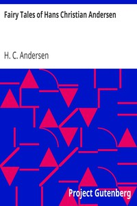

# Fairy Tales of Hans Christian Andersen <kbd>27200</kbd>

## Authors

 - Andersen, H. C. (Hans Christian) <small>(1805 - 1875)</small>

## Subjects

 - Children's stories, Danish -- Translations into English
 - Fairy tales
 - Fairy tales -- Denmark
 - Short stories

## Download

 - https://www.gutenberg.org/files/27200/27200-h.zip
 - https://www.gutenberg.org/files/27200/27200.txt
 - https://www.gutenberg.org/cache/epub/27200/pg27200.cover.small.jpg
 - https://www.gutenberg.org/files/27200/27200-h/27200-h.htm
 - https://www.gutenberg.org/ebooks/27200.html.images
 - https://www.gutenberg.org/ebooks/27200.rdf
 - https://www.gutenberg.org/ebooks/27200.kindle.images
 - https://www.gutenberg.org/ebooks/27200.epub.images
 - https://www.gutenberg.org/ebooks/27200.txt.utf-8

## Book Shelves

