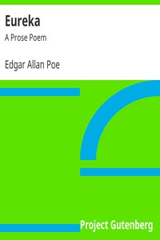

# Eureka: A Prose Poem <kbd>32037</kbd>

## Authors

 - Poe, Edgar Allan <small>(1809 - 1849)</small>

## Subjects

 - Cosmology

## Download

 - https://www.gutenberg.org/files/32037/32037-8.zip
 - https://www.gutenberg.org/cache/epub/32037/pg32037.cover.small.jpg
 - https://www.gutenberg.org/files/32037/32037.txt
 - https://www.gutenberg.org/files/32037/32037-0.txt
 - https://www.gutenberg.org/files/32037/32037-8.txt
 - https://www.gutenberg.org/ebooks/32037.html.images
 - https://www.gutenberg.org/files/32037/32037-h/32037-h.htm
 - https://www.gutenberg.org/ebooks/32037.epub.images
 - https://www.gutenberg.org/ebooks/32037.kindle.images
 - https://www.gutenberg.org/ebooks/32037.rdf

## Book Shelves

