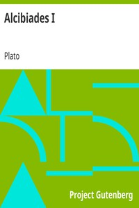

# Alcibiades I <kbd>1676</kbd>

## Authors

 - Plato (spurious and doubtful works) <small>(-428 - -348)</small>

## Subjects

 - Alcibiades
 - Classical literature
 - Socrates, 470 BC-399 BC
 - Virtue -- Early works to 1800

## Download

 - https://www.gutenberg.org/files/1676/1676-h.zip
 - https://www.gutenberg.org/cache/epub/1676/pg1676.cover.medium.jpg
 - https://www.gutenberg.org/files/1676/1676.txt
 - https://www.gutenberg.org/ebooks/1676.html.images
 - https://www.gutenberg.org/files/1676/1676-h/1676-h.htm
 - https://www.gutenberg.org/ebooks/1676.rdf
 - https://www.gutenberg.org/ebooks/1676.epub.images
 - https://www.gutenberg.org/ebooks/1676.kindle.images
 - https://www.gutenberg.org/ebooks/1676.txt.utf-8

## Book Shelves

