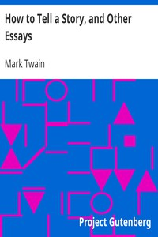

# How to Tell a Story, and Other Essays <kbd>3250</kbd>

## Authors

 - Twain, Mark <small>(1835 - 1910)</small>

## Subjects

 - Essays
 - Short stories
 - Storytelling

## Download

 - https://www.gutenberg.org/cache/epub/3250/pg3250.cover.small.jpg
 - https://www.gutenberg.org/files/3250/3250-0.txt
 - https://www.gutenberg.org/files/3250/3250-h/3250-h.htm
 - https://www.gutenberg.org/ebooks/3250.html.images
 - https://www.gutenberg.org/ebooks/3250.rdf
 - https://www.gutenberg.org/ebooks/3250.epub.images
 - https://www.gutenberg.org/ebooks/3250.kindle.images

## Book Shelves

