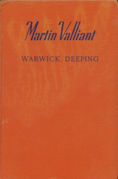

# Martin Valliant <kbd>67586</kbd>

## Authors

 - Deeping, Warwick <small>(1877 - 1950)</small>

## Subjects

 - Great Britain -- History -- Richard III, 1483-1485 -- Fiction
 - Historical fiction
 - Monks -- Fiction
 - Romance fiction

## Download

 - https://www.gutenberg.org/ebooks/67586.txt.utf-8
 - https://www.gutenberg.org/ebooks/67586.rdf
 - https://www.gutenberg.org/ebooks/67586.epub.images
 - https://www.gutenberg.org/files/67586/67586-0.zip
 - https://www.gutenberg.org/files/67586/67586-h.zip
 - https://www.gutenberg.org/cache/epub/67586/pg67586.cover.medium.jpg
 - https://www.gutenberg.org/ebooks/67586.kindle.images
 - https://www.gutenberg.org/ebooks/67586.html.images
 - https://www.gutenberg.org/files/67586/67586-0.txt

## Book Shelves

