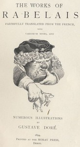

# Gargantua and Pantagruel <kbd>1200</kbd>

## Authors

 - Rabelais, François <small>(null - null)</small>

## Subjects

 - Fantasy fiction, French -- Translations into English
 - Gargantua (Legendary character) -- Fiction
 - Giants -- Fiction

## Download

 - https://www.gutenberg.org/files/1200/1200-0.zip
 - https://www.gutenberg.org/files/1200/1200.zip
 - https://www.gutenberg.org/files/1200/1200-h/1200-h.htm
 - https://www.gutenberg.org/cache/epub/1200/pg1200.cover.small.jpg
 - https://www.gutenberg.org/files/1200/1200-0.txt
 - https://www.gutenberg.org/ebooks/1200.html.images
 - https://www.gutenberg.org/ebooks/1200.kindle.images
 - https://www.gutenberg.org/ebooks/1200.rdf
 - https://www.gutenberg.org/ebooks/1200.epub.images

## Book Shelves

 - Banned Books from Anne Haight's list
 - Best Books Ever Listings
