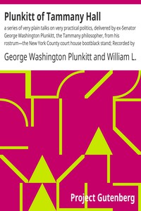

# Plunkitt of Tammany Hall: a series of very plain talks on very practical politics, delivered by ex-Senator George Washington Plunkitt, the Tammany philosopher, from his rostrum—the New York County court house bootblack stand; Recorded by William L. Riordon <kbd>2810</kbd>

## Authors

 - Plunkitt, George Washington <small>(1842 - 1924)</small>

## Subjects

 - Plunkitt, George Washington, 1842-1924
 - Tammany Hall

## Download

 - https://www.gutenberg.org/files/2810/2810-h.zip
 - https://www.gutenberg.org/cache/epub/2810/pg2810.cover.small.jpg
 - https://www.gutenberg.org/files/2810/2810.zip
 - https://www.gutenberg.org/ebooks/2810.html.images
 - https://www.gutenberg.org/files/2810/2810.txt
 - https://www.gutenberg.org/ebooks/2810.rdf
 - https://www.gutenberg.org/ebooks/2810.epub.images
 - https://www.gutenberg.org/ebooks/2810.kindle.images
 - https://www.gutenberg.org/ebooks/2810.txt.utf-8

## Book Shelves

