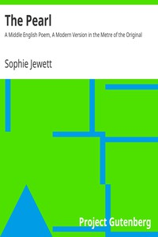

# The Pearl: A Middle English Poem, A Modern Version in the Metre of the Original <kbd>13211</kbd>

## Authors

 - Jewett, Sophie <small>(1861 - 1909)</small>

## Subjects

 - Christian poetry, English (Middle) -- Translations into English

## Download

 - https://www.gutenberg.org/files/13211/13211-8.zip
 - https://www.gutenberg.org/cache/epub/13211/pg13211.cover.small.jpg
 - https://www.gutenberg.org/files/13211/13211.zip
 - https://www.gutenberg.org/files/13211/13211-8.txt
 - https://www.gutenberg.org/ebooks/13211.txt.utf-8
 - https://www.gutenberg.org/ebooks/13211.epub.images
 - https://www.gutenberg.org/ebooks/13211.html.images
 - https://www.gutenberg.org/ebooks/13211.rdf
 - https://www.gutenberg.org/ebooks/13211.kindle.images

## Book Shelves

