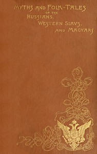

# Myths and Folk-tales of the Russians, Western Slavs, and Magyars <kbd>50011</kbd>

## Authors

 - Curtin, Jeremiah <small>(1835 - 1906)</small>

## Subjects

 - Fairy tales -- Czech Republic
 - Fairy tales -- Hungary
 - Fairy tales -- Russia

## Download

 - https://www.gutenberg.org/files/50011/50011-h.zip
 - https://www.gutenberg.org/files/50011/50011-h/50011-h.htm
 - https://www.gutenberg.org/cache/epub/50011/pg50011.cover.medium.jpg
 - https://www.gutenberg.org/files/50011/50011-0.zip
 - https://www.gutenberg.org/ebooks/50011.html.images
 - https://www.gutenberg.org/ebooks/50011.rdf
 - https://www.gutenberg.org/ebooks/50011.epub.images
 - https://www.gutenberg.org/ebooks/50011.kindle.images

## Book Shelves

