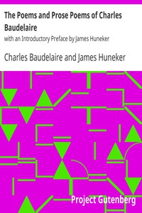

# The Poems and Prose Poems of Charles Baudelaire: with an Introductory Preface by James Huneker <kbd>36287</kbd>

## Authors

 - Baudelaire, Charles <small>(1821 - 1867)</small>

## Subjects

 - French poetry -- Translations into English
 - Prose poems

## Download

 - https://www.gutenberg.org/files/36287/36287.zip
 - https://www.gutenberg.org/files/36287/36287-h.zip
 - https://www.gutenberg.org/files/36287/36287-8.txt
 - https://www.gutenberg.org/files/36287/36287.txt
 - https://www.gutenberg.org/cache/epub/36287/pg36287.cover.medium.jpg
 - https://www.gutenberg.org/ebooks/36287.html.images
 - https://www.gutenberg.org/files/36287/36287-0.txt
 - https://www.gutenberg.org/ebooks/36287.epub.images
 - https://www.gutenberg.org/ebooks/36287.rdf
 - https://www.gutenberg.org/ebooks/36287.kindle.images

## Book Shelves

