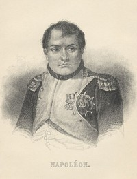

# Memoirs of Napoleon Bonaparte — Complete <kbd>3567</kbd>

## Authors

 - Bourrienne, Louis Antoine Fauvelet de <small>(1769 - 1834)</small>

## Subjects

 - Bourrienne, Louis Antoine Fauvelet de, 1769-1834
 - Napoleon I, Emperor of the French, 1769-1821
 - Napoleon I, Emperor of the French, 1769-1821 -- Contemporaries
 - Napoleon I, Emperor of the French, 1769-1821 -- Relations with private secretaries
 - Private secretaries -- France -- Biography

## Download

 - https://www.gutenberg.org/files/3567/3567.txt
 - https://www.gutenberg.org/cache/epub/3567/pg3567.cover.small.jpg
 - https://www.gutenberg.org/files/3567/3567-h.zip
 - https://www.gutenberg.org/files/3567/3567-h/3567-h.htm
 - https://www.gutenberg.org/ebooks/3567.html.images
 - https://www.gutenberg.org/ebooks/3567.epub.images
 - https://www.gutenberg.org/ebooks/3567.kindle.images
 - https://www.gutenberg.org/ebooks/3567.rdf
 - https://www.gutenberg.org/ebooks/3567.txt.utf-8

## Book Shelves

 - France
 - Napoleonic(Bookshelf)
