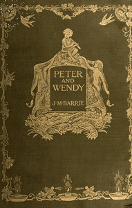

# Peter and Wendy <kbd>26654</kbd>

## Authors

 - Barrie, J. M. (James Matthew) <small>(1860 - 1937)</small>

## Subjects

 - Fairies -- Fiction
 - Fantasy literature
 - Never-Never Land (Imaginary place) -- Fiction
 - Peter Pan (Fictitious character) -- Fiction
 - Pirates -- Fiction

## Download

 - https://www.gutenberg.org/files/26654/26654-8.zip
 - https://www.gutenberg.org/files/26654/26654.zip
 - https://www.gutenberg.org/cache/epub/26654/pg26654.cover.small.jpg
 - https://www.gutenberg.org/files/26654/26654-h/26654-h.htm
 - https://www.gutenberg.org/files/26654/26654.txt
 - https://www.gutenberg.org/ebooks/26654.html.images
 - https://www.gutenberg.org/ebooks/26654.rdf
 - https://www.gutenberg.org/ebooks/26654.txt.utf-8
 - https://www.gutenberg.org/ebooks/26654.kindle.images
 - https://www.gutenberg.org/ebooks/26654.epub.images

## Book Shelves

