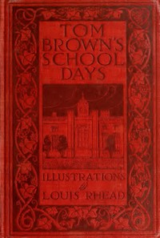

# Tom Brown's School Days <kbd>1480</kbd>

## Authors

 - Hughes, Thomas <small>(1822 - 1896)</small>

## Subjects

 - Bildungsromans
 - Boys -- Fiction
 - Endowed public schools (Great Britain) -- Fiction
 - England -- Fiction
 - Rugby School -- Fiction
 - Schools -- Fiction

## Download

 - https://www.gutenberg.org/files/1480/1480.txt
 - https://www.gutenberg.org/files/1480/1480-0.zip
 - https://www.gutenberg.org/cache/epub/1480/pg1480.cover.medium.jpg
 - https://www.gutenberg.org/ebooks/1480.html.images
 - https://www.gutenberg.org/ebooks/1480.epub.images
 - https://www.gutenberg.org/ebooks/1480.rdf
 - https://www.gutenberg.org/ebooks/1480.kindle.images
 - https://www.gutenberg.org/files/1480/1480-h/1480-h.htm

## Book Shelves

 - School Stories
