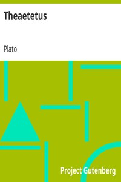

# Theaetetus <kbd>1726</kbd>

## Authors

 - Plato <small>(-428 - -348)</small>

## Subjects

 - Classical literature
 - Knowledge, Theory of -- Early works to 1800

## Download

 - https://www.gutenberg.org/files/1726/1726-h.zip
 - https://www.gutenberg.org/cache/epub/1726/pg1726.cover.medium.jpg
 - https://www.gutenberg.org/files/1726/1726-h/1726-h.htm
 - https://www.gutenberg.org/files/1726/1726.txt
 - https://www.gutenberg.org/ebooks/1726.html.images
 - https://www.gutenberg.org/ebooks/1726.rdf
 - https://www.gutenberg.org/ebooks/1726.epub.images
 - https://www.gutenberg.org/ebooks/1726.kindle.images
 - https://www.gutenberg.org/ebooks/1726.txt.utf-8

## Book Shelves

 - Philosophy
