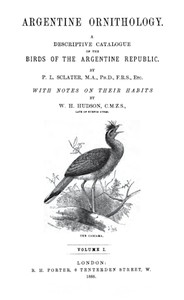

# Argentine Ornithology, Volume 1 (of 2): A descriptive catalogue of the birds of the Argentine Republic. <kbd>38956</kbd>

## Authors

 - Hudson, W. H. (William Henry) <small>(1841 - 1922)</small>
 - Sclater, Philip Lutley <small>(1829 - 1913)</small>

## Subjects

 - Birds -- Argentina

## Download

 - https://www.gutenberg.org/files/38956/38956-8.zip
 - https://www.gutenberg.org/files/38956/38956.zip
 - https://www.gutenberg.org/files/38956/38956-0.txt
 - https://www.gutenberg.org/cache/epub/38956/pg38956.cover.medium.jpg
 - https://www.gutenberg.org/files/38956/38956-h/38956-h.htm
 - https://www.gutenberg.org/files/38956/38956-8.txt
 - https://www.gutenberg.org/ebooks/38956.html.images
 - https://www.gutenberg.org/ebooks/38956.epub.images
 - https://www.gutenberg.org/ebooks/38956.kindle.images
 - https://www.gutenberg.org/ebooks/38956.rdf

## Book Shelves

 - Animal
 - Animals-Wild-Birds
