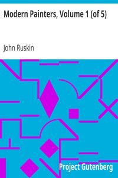

# Modern Painters, Volume 1 (of 5) <kbd>29907</kbd>

## Authors

 - Ruskin, John <small>(1819 - 1900)</small>

## Subjects

 - Aesthetics
 - Painting

## Download

 - https://www.gutenberg.org/files/29907/29907-h/29907-h.htm
 - https://www.gutenberg.org/files/29907/29907-h.zip
 - https://www.gutenberg.org/files/29907/29907-8.zip
 - https://www.gutenberg.org/files/29907/29907.txt
 - https://www.gutenberg.org/cache/epub/29907/pg29907.cover.small.jpg
 - https://www.gutenberg.org/ebooks/29907.html.images
 - https://www.gutenberg.org/ebooks/29907.txt.utf-8
 - https://www.gutenberg.org/ebooks/29907.epub.images
 - https://www.gutenberg.org/ebooks/29907.kindle.images
 - https://www.gutenberg.org/ebooks/29907.rdf

## Book Shelves

