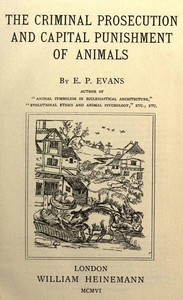

# The Criminal Prosecution and Capital Punishment of Animals <kbd>43286</kbd>

## Authors

 - Evans, E. P. (Edward Payson) <small>(1831 - 1917)</small>

## Subjects

 - Animals -- Law and legislation -- History
 - Animals, Prosecution and punishment of -- History
 - Trials -- Europe

## Download

 - https://www.gutenberg.org/cache/epub/43286/pg43286.cover.small.jpg
 - https://www.gutenberg.org/files/43286/43286-h/43286-h.htm
 - https://www.gutenberg.org/files/43286/43286.txt
 - https://www.gutenberg.org/files/43286/43286-8.zip
 - https://www.gutenberg.org/files/43286/43286-0.zip
 - https://www.gutenberg.org/files/43286/43286-8.txt
 - https://www.gutenberg.org/ebooks/43286.html.images
 - https://www.gutenberg.org/ebooks/43286.rdf
 - https://www.gutenberg.org/ebooks/43286.kindle.images
 - https://www.gutenberg.org/ebooks/43286.epub.images

## Book Shelves

