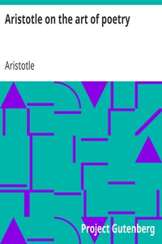

# Aristotle on the art of poetry <kbd>6763</kbd>

## Authors

 - Aristotle <small>(-384 - -322)</small>

## Subjects

 - Aesthetics -- Early works to 1800
 - Music -- Philosophy and aesthetics
 - Poetry -- Early works to 1800

## Download

 - https://www.gutenberg.org/files/6763/6763-h.zip
 - https://www.gutenberg.org/files/6763/6763.zip
 - https://www.gutenberg.org/cache/epub/6763/pg6763.cover.small.jpg
 - https://www.gutenberg.org/files/6763/6763.txt
 - https://www.gutenberg.org/ebooks/6763.html.images
 - https://www.gutenberg.org/ebooks/6763.kindle.images
 - https://www.gutenberg.org/ebooks/6763.rdf
 - https://www.gutenberg.org/ebooks/6763.epub.images
 - https://www.gutenberg.org/ebooks/6763.txt.utf-8

## Book Shelves

 - Classical Antiquity
 - Philosophy
