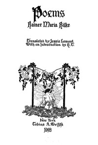

# Poems <kbd>38594</kbd>

## Authors

 - Rilke, Rainer Maria <small>(1875 - 1926)</small>

## Subjects

 - Poetry

## Download

 - https://www.gutenberg.org/files/38594/38594-h.zip
 - https://www.gutenberg.org/files/38594/38594-h/38594-h.htm
 - https://www.gutenberg.org/files/38594/38594-8.zip
 - https://www.gutenberg.org/cache/epub/38594/pg38594.cover.small.jpg
 - https://www.gutenberg.org/files/38594/38594.zip
 - https://www.gutenberg.org/files/38594/38594-0.zip
 - https://www.gutenberg.org/ebooks/38594.html.images
 - https://www.gutenberg.org/ebooks/38594.rdf
 - https://www.gutenberg.org/ebooks/38594.kindle.images
 - https://www.gutenberg.org/ebooks/38594.epub.images

## Book Shelves

