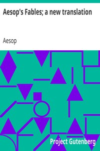

# Aesop's Fables; a new translation <kbd>11339</kbd>

## Authors

 - Aesop <small>(null - null)</small>

## Subjects

 - Fables, Greek -- Translations into English

## Download

 - https://www.gutenberg.org/files/11339/11339-8.zip
 - https://www.gutenberg.org/files/11339/11339.zip
 - https://www.gutenberg.org/files/11339/11339-h.zip
 - https://www.gutenberg.org/cache/epub/11339/pg11339.cover.small.jpg
 - https://www.gutenberg.org/ebooks/11339.html.images
 - https://www.gutenberg.org/files/11339/11339-8.txt
 - https://www.gutenberg.org/ebooks/11339.kindle.images
 - https://www.gutenberg.org/ebooks/11339.txt.utf-8
 - https://www.gutenberg.org/ebooks/11339.epub.images
 - https://www.gutenberg.org/ebooks/11339.rdf

## Book Shelves

