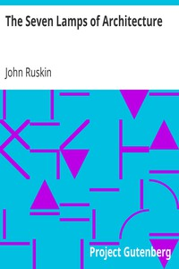

# The Seven Lamps of Architecture <kbd>35898</kbd>

## Authors

 - Ruskin, John <small>(1819 - 1900)</small>

## Subjects

 - Architecture

## Download

 - https://www.gutenberg.org/files/35898/35898.zip
 - https://www.gutenberg.org/files/35898/35898-h.zip
 - https://www.gutenberg.org/files/35898/35898-8.zip
 - https://www.gutenberg.org/cache/epub/35898/pg35898.cover.medium.jpg
 - https://www.gutenberg.org/ebooks/35898.html.images
 - https://www.gutenberg.org/ebooks/35898.kindle.images
 - https://www.gutenberg.org/ebooks/35898.rdf
 - https://www.gutenberg.org/ebooks/35898.txt.utf-8
 - https://www.gutenberg.org/ebooks/35898.epub.images

## Book Shelves

