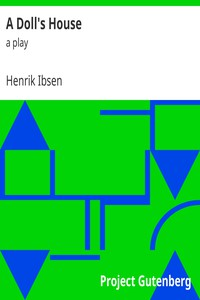

# A Doll's House : a play <kbd>2542</kbd>

## Authors

 - Ibsen, Henrik <small>(1828 - 1906)</small>

## Subjects

 - Man-woman relationships -- Drama
 - Marriage -- Drama
 - Norwegian drama -- Translations into English
 - Wives -- Drama

## Download

 - https://www.gutenberg.org/files/2542/2542-h/2542-h.htm
 - https://www.gutenberg.org/cache/epub/2542/pg2542.cover.small.jpg
 - https://www.gutenberg.org/files/2542/2542-0.zip
 - https://www.gutenberg.org/ebooks/2542.html.images
 - https://www.gutenberg.org/ebooks/2542.epub.images
 - https://www.gutenberg.org/ebooks/2542.rdf
 - https://www.gutenberg.org/ebooks/2542.kindle.images

## Book Shelves

 - Best Books Ever Listings
