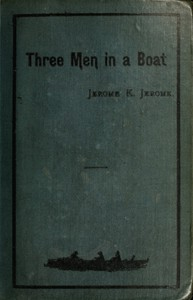

# Three Men in a Boat (To Say Nothing of the Dog) <kbd>308</kbd>

## Authors

 - Jerome, Jerome K. (Jerome Klapka) <small>(1859 - 1927)</small>

## Subjects

 - Boats and boating -- England -- Thames River -- Fiction
 - Dogs -- Fiction
 - Humorous stories, English
 - Male friendship -- Fiction
 - Thames River (England) -- Fiction
 - Young men -- Travel -- England -- Thames River -- Fiction

## Download

 - https://www.gutenberg.org/ebooks/308.txt.utf-8
 - https://www.gutenberg.org/cache/epub/308/pg308.cover.medium.jpg
 - https://www.gutenberg.org/files/308/308-0.zip
 - https://www.gutenberg.org/files/308/308-h/308-h.htm
 - https://www.gutenberg.org/files/308/308.zip
 - https://www.gutenberg.org/files/308/308.txt
 - https://www.gutenberg.org/ebooks/308.kindle.images
 - https://www.gutenberg.org/ebooks/308.rdf
 - https://www.gutenberg.org/ebooks/308.epub.images

## Book Shelves

 - Best Books Ever Listings
 - Humor
