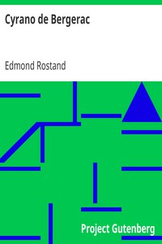

# Cyrano de Bergerac <kbd>1254</kbd>

## Authors

 - Rostand, Edmond <small>(1868 - 1918)</small>

## Subjects

 - Authors, French -- 17th century -- Drama
 - Cyrano de Bergerac, 1619-1655 -- Drama
 - France -- History -- 17th century -- Drama

## Download

 - https://www.gutenberg.org/cache/epub/1254/pg1254.cover.small.jpg
 - https://www.gutenberg.org/files/1254/1254-h/1254-h.htm
 - https://www.gutenberg.org/files/1254/1254-h.zip
 - https://www.gutenberg.org/files/1254/1254.txt
 - https://www.gutenberg.org/ebooks/1254.html.images
 - https://www.gutenberg.org/ebooks/1254.kindle.images
 - https://www.gutenberg.org/ebooks/1254.txt.utf-8
 - https://www.gutenberg.org/ebooks/1254.rdf
 - https://www.gutenberg.org/ebooks/1254.epub.images

## Book Shelves

