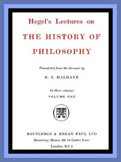

# Hegel's Lectures on the History of Philosophy: Volume 1 (of 3) <kbd>51635</kbd>

## Authors

 - Hegel, Georg Wilhelm Friedrich <small>(1770 - 1831)</small>

## Subjects

 - Philosophy -- History

## Download

 - https://www.gutenberg.org/files/51635/51635-0.zip
 - https://www.gutenberg.org/files/51635/51635-h/51635-h.htm
 - https://www.gutenberg.org/cache/epub/51635/pg51635.cover.medium.jpg
 - https://www.gutenberg.org/ebooks/51635.html.images
 - https://www.gutenberg.org/files/51635/51635-0.txt
 - https://www.gutenberg.org/ebooks/51635.epub.images
 - https://www.gutenberg.org/ebooks/51635.rdf
 - https://www.gutenberg.org/ebooks/51635.kindle.images

## Book Shelves

