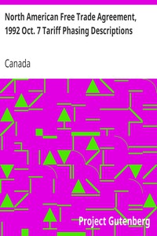

# North American Free Trade Agreement, 1992 Oct. 7 Tariff Phasing Descriptions <kbd>89</kbd>

## Authors

 - Canada <small>(null - null)</small>

## Subjects

 - Canada. Treaties, etc. 1992 Oct. 7
 - Foreign trade regulation -- North America
 - Free trade -- Canada
 - Free trade -- Mexico
 - Free trade -- North America
 - Free trade -- United States
 - Tariff -- Law and legislation -- North America

## Download

 - https://www.gutenberg.org/files/89/89-Contents-8.zip
 - https://www.gutenberg.org/files/89/89-Descriptions.txt
 - https://www.gutenberg.org/files/89/89-Descriptions-8.txt
 - https://www.gutenberg.org/cache/epub/89/pg89.cover.medium.jpg
 - https://www.gutenberg.org/ebooks/89.kindle.images
 - https://www.gutenberg.org/ebooks/89.html.images
 - https://www.gutenberg.org/ebooks/89.txt.utf-8
 - https://www.gutenberg.org/ebooks/89.rdf
 - https://www.gutenberg.org/ebooks/89.epub.images

## Book Shelves

