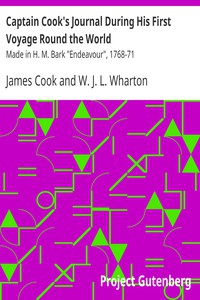

# Captain Cook's Journal During His First Voyage Round the World: Made in H. M. Bark "Endeavour", 1768-71 <kbd>8106</kbd>

## Authors

 - Cook, James <small>(1728 - 1779)</small>

## Subjects

 - Oceania -- Discovery and exploration -- Early works to 1800
 - Voyages around the world -- Early works to 1800

## Download

 - https://www.gutenberg.org/files/8106/8106-h/8106-h.htm
 - https://www.gutenberg.org/cache/epub/8106/pg8106.cover.small.jpg
 - https://www.gutenberg.org/files/8106/8106.txt
 - https://www.gutenberg.org/files/8106/8106.zip
 - https://www.gutenberg.org/ebooks/8106.html.images
 - https://www.gutenberg.org/ebooks/8106.rdf
 - https://www.gutenberg.org/ebooks/8106.txt.utf-8
 - https://www.gutenberg.org/ebooks/8106.kindle.images
 - https://www.gutenberg.org/ebooks/8106.epub.images

## Book Shelves

 - Australia
 - New Zealand
 - Travel
