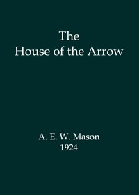

# The House of the Arrow <kbd>67514</kbd>

## Authors

 - Mason, A. E. W. (Alfred Edward Woodley) <small>(1865 - 1948)</small>

## Subjects

 - British -- France -- Fiction
 - Detective and mystery stories
 - Inheritance and succession -- Fiction
 - Lawyers -- Fiction
 - Murder -- Investigation -- Fiction

## Download

 - https://www.gutenberg.org/files/67514/67514-h/67514-h.htm
 - https://www.gutenberg.org/files/67514/67514-h.zip
 - https://www.gutenberg.org/files/67514/67514-0.zip
 - https://www.gutenberg.org/ebooks/67514.rdf
 - https://www.gutenberg.org/ebooks/67514.kindle.images
 - https://www.gutenberg.org/ebooks/67514.epub.images
 - https://www.gutenberg.org/cache/epub/67514/pg67514.cover.small.jpg
 - https://www.gutenberg.org/ebooks/67514.txt.utf-8
 - https://www.gutenberg.org/files/67514/67514-0.txt

## Book Shelves

