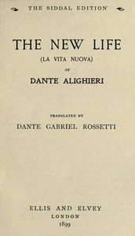

# The New Life (La Vita Nuova) <kbd>41085</kbd>

## Authors

 - Dante Alighieri <small>(1265 - 1321)</small>

## Subjects

 - Italian literature -- Translations into English

## Download

 - https://www.gutenberg.org/files/41085/41085-8.zip
 - https://www.gutenberg.org/files/41085/41085.txt
 - https://www.gutenberg.org/files/41085/41085-h/41085-h.htm
 - https://www.gutenberg.org/files/41085/41085.zip
 - https://www.gutenberg.org/cache/epub/41085/pg41085.cover.small.jpg
 - https://www.gutenberg.org/files/41085/41085-0.txt
 - https://www.gutenberg.org/ebooks/41085.rdf
 - https://www.gutenberg.org/ebooks/41085.kindle.images
 - https://www.gutenberg.org/ebooks/41085.epub.images

## Book Shelves

 - Italy
