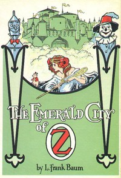

# The Emerald City of Oz <kbd>41667</kbd>

## Authors

 - Baum, L. Frank (Lyman Frank) <small>(1856 - 1919)</small>

## Subjects

 - Animals, Mythical -- Juvenile fiction
 - Aunts -- Juvenile fiction
 - Battles -- Juvenile fiction
 - Fantasy literature
 - Gale, Dorothy (Fictitious character) -- Juvenile fiction
 - Good and evil -- Juvenile fiction
 - Kings and rulers -- Juvenile fiction
 - Magic -- Juvenile fiction
 - Oz (Imaginary place) -- Juvenile fiction
 - Princess Ozma (Fictitious character) -- Juvenile fiction
 - Uncles -- Juvenile fiction
 - Voyages and travels -- Juvenile fiction

## Download

 - https://www.gutenberg.org/files/41667/41667-h.zip
 - https://www.gutenberg.org/files/41667/41667.txt
 - https://www.gutenberg.org/files/41667/41667-h/41667-h.htm
 - https://www.gutenberg.org/cache/epub/41667/pg41667.cover.medium.jpg
 - https://www.gutenberg.org/ebooks/41667.html.images
 - https://www.gutenberg.org/ebooks/41667.kindle.images
 - https://www.gutenberg.org/ebooks/41667.txt.utf-8
 - https://www.gutenberg.org/ebooks/41667.rdf
 - https://www.gutenberg.org/ebooks/41667.epub.images

## Book Shelves

