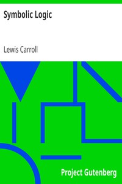

# Symbolic Logic <kbd>28696</kbd>

## Authors

 - Carroll, Lewis <small>(1832 - 1898)</small>

## Subjects

 - Logic, Symbolic and mathematical

## Download

 - https://www.gutenberg.org/files/28696/28696-8.txt
 - https://www.gutenberg.org/files/28696/28696.zip
 - https://www.gutenberg.org/cache/epub/28696/pg28696.cover.medium.jpg
 - https://www.gutenberg.org/files/28696/28696-h/28696-h.htm
 - https://www.gutenberg.org/files/28696/28696-8.zip
 - https://www.gutenberg.org/ebooks/28696.html.images
 - https://www.gutenberg.org/ebooks/28696.txt.utf-8
 - https://www.gutenberg.org/ebooks/28696.rdf
 - https://www.gutenberg.org/ebooks/28696.kindle.images
 - https://www.gutenberg.org/ebooks/28696.epub.images

## Book Shelves

 - Philosophy
