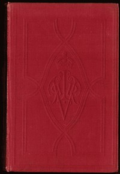

# The Letters of Queen Victoria : A Selection from Her Majesty's Correspondence between the Years 1837 and 1861. Volume 1, 1837-1843 <kbd>20023</kbd>

## Authors

 - Victoria, Queen of Great Britain <small>(1819 - 1901)</small>

## Subjects

 - Europe -- Politics and government -- 1848-1871
 - Great Britain -- History -- Victoria, 1837-1901
 - Great Britain -- History -- Victoria, 1837-1901 -- Sources
 - Great Britain -- Politics and government -- 1837-1901
 - Victoria, Queen of Great Britain, 1819-1901 -- Correspondence

## Download

 - https://www.gutenberg.org/files/20023/20023-h.zip
 - https://www.gutenberg.org/files/20023/20023-8.zip
 - https://www.gutenberg.org/files/20023/20023-8.txt
 - https://www.gutenberg.org/cache/epub/20023/pg20023.cover.medium.jpg
 - https://www.gutenberg.org/files/20023/20023.txt
 - https://www.gutenberg.org/ebooks/20023.html.images
 - https://www.gutenberg.org/ebooks/20023.kindle.images
 - https://www.gutenberg.org/ebooks/20023.txt.utf-8
 - https://www.gutenberg.org/ebooks/20023.epub.images
 - https://www.gutenberg.org/ebooks/20023.rdf

## Book Shelves

 - United Kingdom
