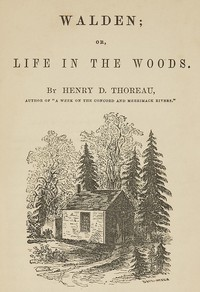

# Walden, and On The Duty Of Civil Disobedience <kbd>205</kbd>

## Authors

 - Thoreau, Henry David <small>(1817 - 1862)</small>

## Subjects

 - Authors, American -- 19th century -- Biography
 - Civil disobedience
 - Government, Resistance to
 - Natural history -- Massachusetts -- Walden Woods
 - Solitude
 - Thoreau, Henry David, 1817-1862 -- Homes and haunts -- Massachusetts -- Walden Woods
 - Walden Woods (Mass.) -- Social life and customs
 - Wilderness areas -- Massachusetts -- Walden Woods

## Download

 - https://www.gutenberg.org/files/205/205-h/205-h.htm
 - https://www.gutenberg.org/files/205/205-0.zip
 - https://www.gutenberg.org/cache/epub/205/pg205.cover.medium.jpg
 - https://www.gutenberg.org/files/205/205-0.txt
 - https://www.gutenberg.org/ebooks/205.html.images
 - https://www.gutenberg.org/ebooks/205.kindle.images
 - https://www.gutenberg.org/ebooks/205.rdf
 - https://www.gutenberg.org/ebooks/205.epub.images

## Book Shelves

