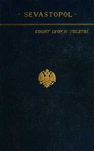

# Sevastopol <kbd>47197</kbd>

## Authors

 - Tolstoy, Leo, graf <small>(1828 - 1910)</small>

## Subjects

 - Sevastopol (Ukraine) -- History -- Siege, 1854-1855 -- Fiction

## Download

 - https://www.gutenberg.org/files/47197/47197-0.txt
 - https://www.gutenberg.org/files/47197/47197-8.zip
 - https://www.gutenberg.org/files/47197/47197.zip
 - https://www.gutenberg.org/files/47197/47197-h.zip
 - https://www.gutenberg.org/cache/epub/47197/pg47197.cover.small.jpg
 - https://www.gutenberg.org/ebooks/47197.html.images
 - https://www.gutenberg.org/ebooks/47197.epub.images
 - https://www.gutenberg.org/ebooks/47197.rdf
 - https://www.gutenberg.org/ebooks/47197.kindle.images

## Book Shelves

