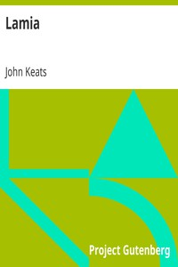

# Lamia <kbd>2490</kbd>

## Authors

 - Keats, John <small>(1795 - 1821)</small>

## Subjects

 - English poetry -- 19th century

## Download

 - https://www.gutenberg.org/files/2490/2490-h.zip
 - https://www.gutenberg.org/cache/epub/2490/pg2490.cover.small.jpg
 - https://www.gutenberg.org/files/2490/2490-h/2490-h.htm
 - https://www.gutenberg.org/ebooks/2490.html.images
 - https://www.gutenberg.org/ebooks/2490.rdf
 - https://www.gutenberg.org/ebooks/2490.epub.images
 - https://www.gutenberg.org/ebooks/2490.kindle.images
 - https://www.gutenberg.org/files/2490/2490.txt
 - https://www.gutenberg.org/ebooks/2490.txt.utf-8

## Book Shelves

 - Poetry
