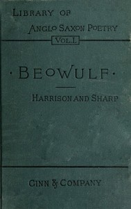

# I. Beówulf: an Anglo-Saxon poem. II. The fight at Finnsburh: a fragment. <kbd>9700</kbd>

## Authors

## Subjects

 - Dragons -- Poetry
 - Epic poetry, English (Old)
 - Monsters -- Poetry

## Download

 - https://www.gutenberg.org/cache/epub/9700/pg9700.cover.medium.jpg
 - https://www.gutenberg.org/files/9700/9700-0.txt
 - https://www.gutenberg.org/ebooks/9700.html.images
 - https://www.gutenberg.org/files/9700/9700-h/9700-h.htm
 - https://www.gutenberg.org/ebooks/9700.rdf
 - https://www.gutenberg.org/ebooks/9700.kindle.images
 - https://www.gutenberg.org/ebooks/9700.epub.images

## Book Shelves

 - Poetry
