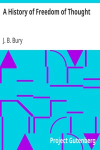

# A History of Freedom of Thought <kbd>10684</kbd>

## Authors

 - Bury, J. B. (John Bagnell) <small>(1861 - 1927)</small>

## Subjects

 - Free thought -- History
 - Rationalism -- History

## Download

 - https://www.gutenberg.org/files/10684/10684.zip
 - https://www.gutenberg.org/cache/epub/10684/pg10684.cover.medium.jpg
 - https://www.gutenberg.org/files/10684/10684-8.zip
 - https://www.gutenberg.org/files/10684/10684-h.zip
 - https://www.gutenberg.org/ebooks/10684.html.images
 - https://www.gutenberg.org/files/10684/10684-h/10684-h.htm
 - https://www.gutenberg.org/ebooks/10684.txt.utf-8
 - https://www.gutenberg.org/ebooks/10684.epub.images
 - https://www.gutenberg.org/ebooks/10684.rdf
 - https://www.gutenberg.org/ebooks/10684.kindle.images

## Book Shelves

