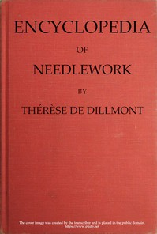

# Encyclopedia of Needlework <kbd>20776</kbd>

## Authors

 - Dillmont, Thérèse de <small>(1846 - 1890)</small>

## Subjects

 - Needlework

## Download

 - https://www.gutenberg.org/files/20776/20776-h/20776-h.htm
 - https://www.gutenberg.org/files/20776/20776-0.zip
 - https://www.gutenberg.org/cache/epub/20776/pg20776.cover.small.jpg
 - https://www.gutenberg.org/ebooks/20776.html.images
 - https://www.gutenberg.org/ebooks/20776.epub.images
 - https://www.gutenberg.org/ebooks/20776.rdf
 - https://www.gutenberg.org/ebooks/20776.kindle.images

## Book Shelves

 - Crafts
 - Reference
 - Technology
