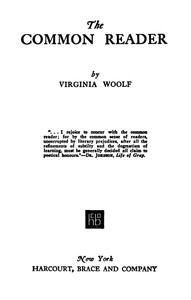

# The Common Reader <kbd>64457</kbd>

## Authors

 - Woolf, Virginia <small>(1882 - 1941)</small>

## Subjects

 - English literature -- History and criticism
 - Literature, Modern -- History and criticism

## Download

 - https://www.gutenberg.org/cache/epub/64457/pg64457.cover.medium.jpg
 - https://www.gutenberg.org/files/64457/64457-0.txt
 - https://www.gutenberg.org/files/64457/64457-h/64457-h.htm
 - https://www.gutenberg.org/files/64457/64457-h.zip
 - https://www.gutenberg.org/ebooks/64457.html.images
 - https://www.gutenberg.org/ebooks/64457.rdf
 - https://www.gutenberg.org/ebooks/64457.kindle.images
 - https://www.gutenberg.org/ebooks/64457.epub.images

## Book Shelves

