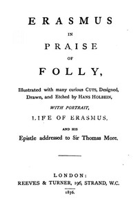

# In Praise of Folly: Illustrated with Many Curious Cuts <kbd>30201</kbd>

## Authors

 - Erasmus, Desiderius <small>(1469 - 1536)</small>

## Subjects

 - Folly -- Early works to 1800

## Download

 - https://www.gutenberg.org/files/30201/30201-h.zip
 - https://www.gutenberg.org/cache/epub/30201/pg30201.cover.medium.jpg
 - https://www.gutenberg.org/files/30201/30201.zip
 - https://www.gutenberg.org/ebooks/30201.html.images
 - https://www.gutenberg.org/files/30201/30201-h/30201-h.htm
 - https://www.gutenberg.org/ebooks/30201.txt.utf-8
 - https://www.gutenberg.org/ebooks/30201.epub.images
 - https://www.gutenberg.org/ebooks/30201.rdf
 - https://www.gutenberg.org/ebooks/30201.kindle.images

## Book Shelves

 - Banned Books from Anne Haight's list
