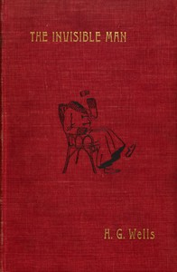

# The Invisible Man: A Grotesque Romance <kbd>5230</kbd>

## Authors

 - Wells, H. G. (Herbert George) <small>(1866 - 1946)</small>

## Subjects

 - Mentally ill -- Fiction
 - Psychological fiction
 - Science fiction
 - Scientists -- Fiction

## Download

 - https://www.gutenberg.org/files/5230/5230-0.zip
 - https://www.gutenberg.org/cache/epub/5230/pg5230.cover.small.jpg
 - https://www.gutenberg.org/ebooks/5230.html.images
 - https://www.gutenberg.org/ebooks/5230.txt.utf-8
 - https://www.gutenberg.org/files/5230/5230-0.txt
 - https://www.gutenberg.org/ebooks/5230.kindle.images
 - https://www.gutenberg.org/ebooks/5230.epub.images
 - https://www.gutenberg.org/ebooks/5230.rdf

## Book Shelves

 - Movie Books
