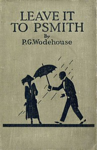

# Leave it to Psmith <kbd>60067</kbd>

## Authors

 - Wodehouse, P. G. (Pelham Grenville) <small>(1881 - 1975)</small>

## Subjects

 - Blandings Castle (England : Imaginary place) -- Fiction
 - Humorous stories
 - Impostors and imposture -- Fiction
 - Jewel thieves -- Fiction
 - Nobility -- Fiction
 - Shropshire (England) -- Fiction

## Download

 - https://www.gutenberg.org/cache/epub/60067/pg60067.cover.small.jpg
 - https://www.gutenberg.org/files/60067/60067-h.zip
 - https://www.gutenberg.org/ebooks/60067.html.images
 - https://www.gutenberg.org/ebooks/60067.txt.utf-8
 - https://www.gutenberg.org/files/60067/60067-0.txt
 - https://www.gutenberg.org/ebooks/60067.rdf
 - https://www.gutenberg.org/ebooks/60067.kindle.images
 - https://www.gutenberg.org/ebooks/60067.epub.images

## Book Shelves

