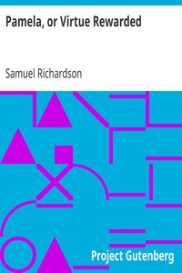

# Pamela, or Virtue Rewarded <kbd>6124</kbd>

## Authors

 - Richardson, Samuel <small>(1689 - 1761)</small>

## Subjects

 - Didactic fiction
 - England -- Fiction
 - Epistolary fiction
 - Kidnapping victims -- Fiction
 - Master and servant -- Fiction
 - Virtue -- Fiction
 - Women household employees -- Fiction

## Download

 - https://www.gutenberg.org/ebooks/6124.txt.utf-8
 - https://www.gutenberg.org/ebooks/6124.html.images
 - https://www.gutenberg.org/files/6124/6124-0.zip
 - https://www.gutenberg.org/cache/epub/6124/pg6124.cover.small.jpg
 - https://www.gutenberg.org/files/6124/6124-0.txt
 - https://www.gutenberg.org/ebooks/6124.kindle.images
 - https://www.gutenberg.org/ebooks/6124.rdf
 - https://www.gutenberg.org/ebooks/6124.epub.images

## Book Shelves

 - Banned Books from Anne Haight's list
 - Opera
