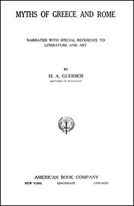

# Myths of Greece and Rome: Narrated with Special Reference to Literature and Art <kbd>39250</kbd>

## Authors

 - Guerber, H. A. (Hélène Adeline) <small>(1859 - 1929)</small>

## Subjects

 - Mythology, Classical

## Download

 - https://www.gutenberg.org/files/39250/39250-h.zip
 - https://www.gutenberg.org/files/39250/39250-8.zip
 - https://www.gutenberg.org/cache/epub/39250/pg39250.cover.medium.jpg
 - https://www.gutenberg.org/files/39250/39250.zip
 - https://www.gutenberg.org/files/39250/39250-8.txt
 - https://www.gutenberg.org/files/39250/39250-0.txt
 - https://www.gutenberg.org/ebooks/39250.html.images
 - https://www.gutenberg.org/ebooks/39250.rdf
 - https://www.gutenberg.org/ebooks/39250.kindle.images
 - https://www.gutenberg.org/ebooks/39250.epub.images

## Book Shelves

