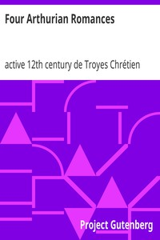

# Four Arthurian Romances <kbd>831</kbd>

## Authors

 - Chrétien, de Troyes, active 12th century <small>(null - null)</small>

## Subjects

 - Arthurian romances
 - Chrétien, de Troyes, active 12th century
 - Romances -- Translations into English
 - Tales, Medieval

## Download

 - https://www.gutenberg.org/files/831/831.zip
 - https://www.gutenberg.org/files/831/831-h/831-h.htm
 - https://www.gutenberg.org/cache/epub/831/pg831.cover.small.jpg
 - https://www.gutenberg.org/ebooks/831.html.images
 - https://www.gutenberg.org/ebooks/831.kindle.images
 - https://www.gutenberg.org/ebooks/831.txt.utf-8
 - https://www.gutenberg.org/ebooks/831.rdf
 - https://www.gutenberg.org/ebooks/831.epub.images

## Book Shelves

 - Arthurian Legends
 - Fantasy
